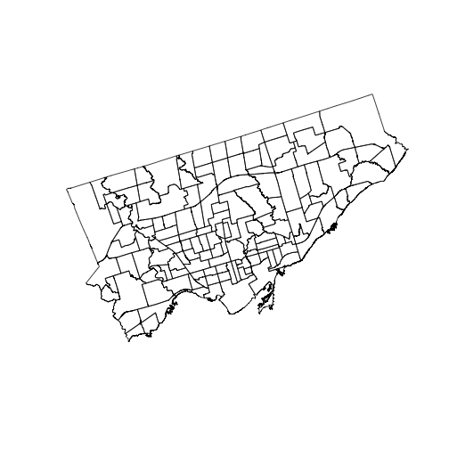
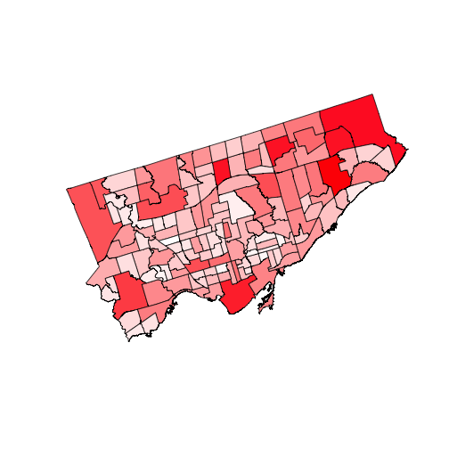
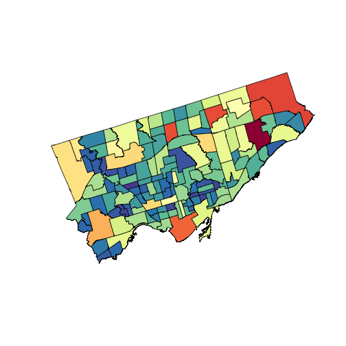
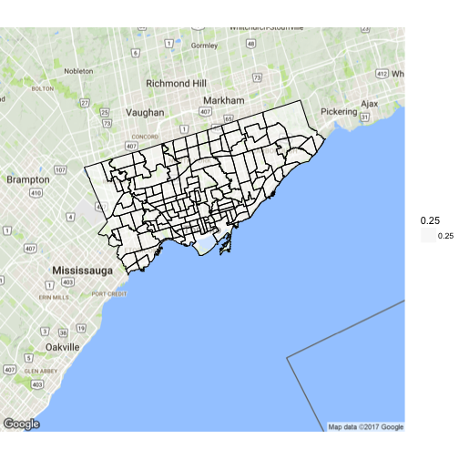
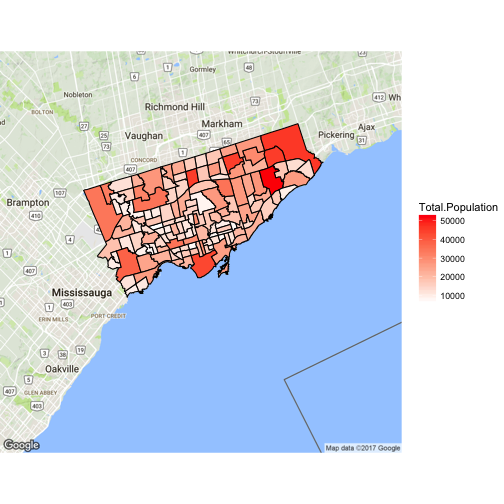
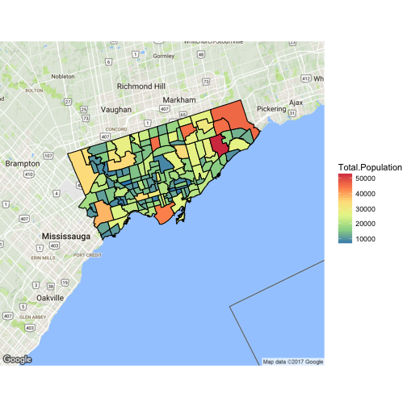

# graphing IL from Toronto example

## may 7, 2017

modify the toronto example to use the 
Israeli data
## load setup code, simulate thesis state 

```r
library(RColorBrewer)
library(maptools)
library(ggmap)
library(rgeos)
library(censusFunctions) 
importData("savedGoogleMap")
```

```
## Warning in file(filename, "r"): cannot open file '../dataframes/
## mapImageData3.txt': No such file or directory
```

```
## Error in file(filename, "r"): cannot open the connection
```

```r
# Read the neighborhood shapefile data and plot
setwd("~/scratch/toronto_neighbourhoods")
shpfile <- "NEIGHBORHOODS_WGS84_2.shp"
sh <- rgdal::readOGR(shpfile)
```

```
## OGR data source with driver: ESRI Shapefile 
## Source: "NEIGHBORHOODS_WGS84_2.shp", layer: "NEIGHBORHOODS_WGS84_2"
## with 140 features
## It has 2 fields
```

```r
plot(sh)
```



```r
# Add demographic data
# The neighbourhood ID is a string - change it to a integer
sh@data$AREA_S_CD <- as.numeric(sh@data$AREA_S_CD)

# Read in the demographic data and merge on Neighbourhood Id
demo <- read.csv(file="WB-Demographics.csv", header=T)
sh2 <- merge(sh, demo, by.x='AREA_S_CD', by.y='Neighbourhood.Id')
```
now, what does this col=cols line do?


```r
# Set the palette
# creates 128 shades between white and red
p <- colorRampPalette(c("white", "red"))(128)
palette(p)

# Scale the total population to the palette
pop <- sh2@data$Total.Population
cols <- (pop - min(pop))/diff(range(pop))*127+1
# what is this cols variable?
# View(cols) #don't call view in ess, only Rstudio'
pop  # city-section populations range from 7k to 50k
```

```
##   [1] 11655 27715 14640 14685 24690 27390 21135 10140 19225 16710 14110
##  [12] 38070  9450  9950 16615 21245 25640 17955 15595 12530 15850 13100
##  [23] 28345 24775 15700 22165 13735 13095 14015 11565 11200 12195 10925
##  [34] 12475 31395 14075  9815 16805 17180 43365 26550 34100 25445 17050
##  [45] 21725 13535 14610 10640 18315  9115 10485 18500  9175  9635 10925
##  [56] 11340 29180  9855 10580 15050  7790 17650 13150 24360 14945 34635
##  [67] 23050 21000  6490 21300 21750 13100 17825 13505 20635 21075 27020
##  [78] 22830  9550 30280 21990 22080 18805 44915 26910 15435 11900 10010
##  [89] 27870 21860 12015 34650  7920 19345 22060 45025 15005 45905 32790
## [100] 12050 15980 28590  7765 10485 20840 10905 13735 34620  8705  7655
## [111] 21345 53350  7825 17675 23185 22270  8715 26735 18170 15075 17785
## [122]  9630 45085 11450 10195 10435 25010 14540 10580 26550 17585 16310
## [133] 12055 11705 16425 27160 16145 13985 17010 14295
```

```r
cols[1]
```

```
## [1] 14.99819
```

```r
range(cols)
```

```
## [1]   1 128
```

```r
pop[12]
```

```
## [1] 38070
```

```r
# what column names are there?
names(sh2@data)
```

```
##  [1] "AREA_S_CD"                  "AREA_NAME"                 
##  [3] "Neighbourhood"              "Total.Area"                
##  [5] "Total.Population"           "Pop...Males"               
##  [7] "Pop...Females"              "Pop.0...4.years"           
##  [9] "Pop.5...9.years"            "Pop.10...14.years"         
## [11] "Pop.15..19.years"           "Pop.20...24.years"         
## [13] "Pop..25...29.years"         "Pop.30...34.years"         
## [15] "Pop.35...39.years"          "Pop.40...44.years"         
## [17] "Pop.45...49.years"          "Pop.50...54.years"         
## [19] "Pop.55...59.years"          "Pop.60...64.years"         
## [21] "Pop.65...69.years"          "Pop.70...74.years"         
## [23] "Pop.75...79.years"          "Pop.80...84.years"         
## [25] "Pop.85.years.and.over"      "Seniors.55.and.over"       
## [27] "Seniors.65.and.over"        "Child.0.14"                
## [29] "Youth.15.24"                "Home.Language.Category"    
## [31] "Language...Chinese"         "Language...Italian"        
## [33] "Language...Korean"          "Language...Persian..Farsi."
## [35] "Language...Portuguese"      "Language...Russian"        
## [37] "Language...Spanish"         "Language...Tagalog"        
## [39] "Language...Tamil"           "Language...Urdu"
```
What is the population of the 12th area?

```r
pop[12]
```

```
## [1] 38070
```
What is the name of that area?

```r
sh2@data$AREA_NAME[12]
```

```
## [1] Islington-City Centre West (14)
## 140 Levels: Agincourt North (129) ... Yorkdale-Glen Park (31)
```
Does this area have any aliases?

```r
sh2@data$Neighbourhood[12]
```

```
## [1] Islington-City Centre West
## 140 Levels: Agincourt North Agincourt South-Malvern West ... Yorkdale-Glen Park
```
### Can you say any of that with inline code?
The population of region `sh2@data$AREA_NAME[12]` aka
`sh2@data$Neighbourhood[12]` was `pop[12]` in 1998.
By 2010 it had grown to `pop[22]`.
This paragraph is interesting because, blah.


```r
plot(sh, col = cols)
```



```r
#RColorBrewer, spectral
p <- colorRampPalette(brewer.pal(11, 'Spectral'))(128)
palette(rev(p))
plot(sh2, col = cols)
```



```r
#GGPLOT 
points <- fortify(sh, region = 'AREA_S_CD')

# Plot the neighborhoods
toronto <- qmap("Toronto, Ontario", zoom = 10)
```

```
## Source : https://maps.googleapis.com/maps/api/staticmap?center=Toronto,+Ontario&zoom=10&size=640x640&scale=2&maptype=terrain&language=en-EN
```

```
## Source : https://maps.googleapis.com/maps/api/geocode/json?address=Toronto%2C%20Ontario
```

```
## Warning in structure(NULL, class = "waiver"): Calling 'structure(NULL, *)' is deprecated, as NULL cannot have attributes.
##   Consider 'structure(list(), *)' instead.

## Warning in structure(NULL, class = "waiver"): Calling 'structure(NULL, *)' is deprecated, as NULL cannot have attributes.
##   Consider 'structure(list(), *)' instead.

## Warning in structure(NULL, class = "waiver"): Calling 'structure(NULL, *)' is deprecated, as NULL cannot have attributes.
##   Consider 'structure(list(), *)' instead.

## Warning in structure(NULL, class = "waiver"): Calling 'structure(NULL, *)' is deprecated, as NULL cannot have attributes.
##   Consider 'structure(list(), *)' instead.

## Warning in structure(NULL, class = "waiver"): Calling 'structure(NULL, *)' is deprecated, as NULL cannot have attributes.
##   Consider 'structure(list(), *)' instead.

## Warning in structure(NULL, class = "waiver"): Calling 'structure(NULL, *)' is deprecated, as NULL cannot have attributes.
##   Consider 'structure(list(), *)' instead.

## Warning in structure(NULL, class = "waiver"): Calling 'structure(NULL, *)' is deprecated, as NULL cannot have attributes.
##   Consider 'structure(list(), *)' instead.

## Warning in structure(NULL, class = "waiver"): Calling 'structure(NULL, *)' is deprecated, as NULL cannot have attributes.
##   Consider 'structure(list(), *)' instead.

## Warning in structure(NULL, class = "waiver"): Calling 'structure(NULL, *)' is deprecated, as NULL cannot have attributes.
##   Consider 'structure(list(), *)' instead.

## Warning in structure(NULL, class = "waiver"): Calling 'structure(NULL, *)' is deprecated, as NULL cannot have attributes.
##   Consider 'structure(list(), *)' instead.

## Warning in structure(NULL, class = "waiver"): Calling 'structure(NULL, *)' is deprecated, as NULL cannot have attributes.
##   Consider 'structure(list(), *)' instead.

## Warning in structure(NULL, class = "waiver"): Calling 'structure(NULL, *)' is deprecated, as NULL cannot have attributes.
##   Consider 'structure(list(), *)' instead.
```

```r
toronto + geom_polygon(aes(x=long,y=lat, group=group, alpha=0.25), data=points, fill='white') + geom_polygon(aes(x=long,y=lat, group=group), data=points, color='black', fill=NA)
```

```
## Warning in structure(NULL, class = "waiver"): Calling 'structure(NULL, *)' is deprecated, as NULL cannot have attributes.
##   Consider 'structure(list(), *)' instead.

## Warning in structure(NULL, class = "waiver"): Calling 'structure(NULL, *)' is deprecated, as NULL cannot have attributes.
##   Consider 'structure(list(), *)' instead.

## Warning in structure(NULL, class = "waiver"): Calling 'structure(NULL, *)' is deprecated, as NULL cannot have attributes.
##   Consider 'structure(list(), *)' instead.

## Warning in structure(NULL, class = "waiver"): Calling 'structure(NULL, *)' is deprecated, as NULL cannot have attributes.
##   Consider 'structure(list(), *)' instead.

## Warning in structure(NULL, class = "waiver"): Calling 'structure(NULL, *)' is deprecated, as NULL cannot have attributes.
##   Consider 'structure(list(), *)' instead.

## Warning in structure(NULL, class = "waiver"): Calling 'structure(NULL, *)' is deprecated, as NULL cannot have attributes.
##   Consider 'structure(list(), *)' instead.

## Warning in structure(NULL, class = "waiver"): Calling 'structure(NULL, *)' is deprecated, as NULL cannot have attributes.
##   Consider 'structure(list(), *)' instead.

## Warning in structure(NULL, class = "waiver"): Calling 'structure(NULL, *)' is deprecated, as NULL cannot have attributes.
##   Consider 'structure(list(), *)' instead.
```



```r
# merge the shapefile data with the social housing data, using the neighborhood ID
points2 <- merge(points, demo, by.x='id', by.y='Neighbourhood.Id', all.x=TRUE)

# Plot
toronto + geom_polygon(aes(x=long,y=lat, group=group, fill=Total.Population), data=points2, color='black') + 
  scale_fill_gradient(low='white', high='red')
```

```
## Warning in structure(NULL, class = "waiver"): Calling 'structure(NULL, *)' is deprecated, as NULL cannot have attributes.
##   Consider 'structure(list(), *)' instead.

## Warning in structure(NULL, class = "waiver"): Calling 'structure(NULL, *)' is deprecated, as NULL cannot have attributes.
##   Consider 'structure(list(), *)' instead.

## Warning in structure(NULL, class = "waiver"): Calling 'structure(NULL, *)' is deprecated, as NULL cannot have attributes.
##   Consider 'structure(list(), *)' instead.

## Warning in structure(NULL, class = "waiver"): Calling 'structure(NULL, *)' is deprecated, as NULL cannot have attributes.
##   Consider 'structure(list(), *)' instead.

## Warning in structure(NULL, class = "waiver"): Calling 'structure(NULL, *)' is deprecated, as NULL cannot have attributes.
##   Consider 'structure(list(), *)' instead.

## Warning in structure(NULL, class = "waiver"): Calling 'structure(NULL, *)' is deprecated, as NULL cannot have attributes.
##   Consider 'structure(list(), *)' instead.

## Warning in structure(NULL, class = "waiver"): Calling 'structure(NULL, *)' is deprecated, as NULL cannot have attributes.
##   Consider 'structure(list(), *)' instead.

## Warning in structure(NULL, class = "waiver"): Calling 'structure(NULL, *)' is deprecated, as NULL cannot have attributes.
##   Consider 'structure(list(), *)' instead.
```



```r
# Spectral plot
toronto + geom_polygon(aes(x=long,y=lat, group=group, fill=Total.Population), data=points2, color='black') + 
  scale_fill_distiller(palette='Spectral') + scale_alpha(range=c(0.5,0.5))
```

```
## Warning in structure(NULL, class = "waiver"): Calling 'structure(NULL, *)' is deprecated, as NULL cannot have attributes.
##   Consider 'structure(list(), *)' instead.

## Warning in structure(NULL, class = "waiver"): Calling 'structure(NULL, *)' is deprecated, as NULL cannot have attributes.
##   Consider 'structure(list(), *)' instead.

## Warning in structure(NULL, class = "waiver"): Calling 'structure(NULL, *)' is deprecated, as NULL cannot have attributes.
##   Consider 'structure(list(), *)' instead.

## Warning in structure(NULL, class = "waiver"): Calling 'structure(NULL, *)' is deprecated, as NULL cannot have attributes.
##   Consider 'structure(list(), *)' instead.

## Warning in structure(NULL, class = "waiver"): Calling 'structure(NULL, *)' is deprecated, as NULL cannot have attributes.
##   Consider 'structure(list(), *)' instead.

## Warning in structure(NULL, class = "waiver"): Calling 'structure(NULL, *)' is deprecated, as NULL cannot have attributes.
##   Consider 'structure(list(), *)' instead.

## Warning in structure(NULL, class = "waiver"): Calling 'structure(NULL, *)' is deprecated, as NULL cannot have attributes.
##   Consider 'structure(list(), *)' instead.

## Warning in structure(NULL, class = "waiver"): Calling 'structure(NULL, *)' is deprecated, as NULL cannot have attributes.
##   Consider 'structure(list(), *)' instead.

## Warning in structure(NULL, class = "waiver"): Calling 'structure(NULL, *)' is deprecated, as NULL cannot have attributes.
##   Consider 'structure(list(), *)' instead.

## Warning in structure(NULL, class = "waiver"): Calling 'structure(NULL, *)' is deprecated, as NULL cannot have attributes.
##   Consider 'structure(list(), *)' instead.

## Warning in structure(NULL, class = "waiver"): Calling 'structure(NULL, *)' is deprecated, as NULL cannot have attributes.
##   Consider 'structure(list(), *)' instead.

## Warning in structure(NULL, class = "waiver"): Calling 'structure(NULL, *)' is deprecated, as NULL cannot have attributes.
##   Consider 'structure(list(), *)' instead.

## Warning in structure(NULL, class = "waiver"): Calling 'structure(NULL, *)' is deprecated, as NULL cannot have attributes.
##   Consider 'structure(list(), *)' instead.

## Warning in structure(NULL, class = "waiver"): Calling 'structure(NULL, *)' is deprecated, as NULL cannot have attributes.
##   Consider 'structure(list(), *)' instead.
```


